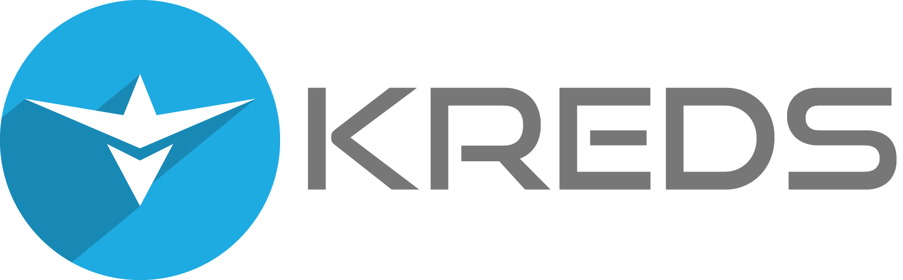

## Introducing Kreds

Introducing a new decentralised, open source, community driven digital currency.

__________________________________________________________________________
### Specifications

###### Version: 1.0.0.4
###### Proof-of-Work Algorithm: Lyra2REv2
###### Block Max Size: 4 MB
###### Max Block Size Serialized Size: 8 MB
###### Block Time: ~120 seconds
###### Block Reward: 112,5 KREDS
###### Block Reward Decrease: 1.5% every 6 months for 10 years
###### Coin Maturity: 50 blocks
###### Maximum Coin Supply: 1.1B
###### Difficulty Retargeting: New D106 Algorithm
###### Network RPC Port: 3850
###### Network P2P Port: 3950
###### SegWit: Active
###### Lightning Network: Compatible
###### Atomic Swaps: Compatible
###### Masternodes: Enabled
###### Masternodes Collateral: 100000 KREDS
###### Masternodes Payments Start Block: 15000
###### Masternode Reward: 50% of block reward

__________________________________________________________________________

#### Masternodes

Masternodes will be supported with a collateral requirement of **100000 KREDS**.  

Masternode payments do not start until block 15000.

**Kreds Rewards Structure**
				
Year  |	       Blocks         |	  PoW   |  Masternodes | Total Generated per Block |
------|-----------------------|---------|--------------|---------------------------|
2018  | 0 -   60,000 | 112.5  |  112.5  |	   225     |                           |
2018* | 60,001 -  131,400     |	 56.25  |    56.25     |       112.5               |
2018  |	131,401 -  262,800    |	 56.25  |    56.25     |	   112.5               |
2019  |	262,801 -  394,200    |	 55.41  |    55.41     |	   110.81              |
2019  |	394,201 -  525,600    |	 54.58  |    54.58     |	   109.15              |
2020  |	525,601 -  657,000    |	 53.76  |    53.76     |	   107.51              |
2020  |	657,001 -  788,400    |	 52.95  |    52.95     |	   105.90              |
2021  | 788,401 -  919,800    |	 52.16  |    52.16     |	   104.31              |
2021  |	919,802 - 1,051,200   |	 51.37  |    51.37     |	   102.75              |
2022  |	1,051,201 - 1,182,600 |	 50.60  |    50.60     |	   101.21              |
2022  |	1,182,601 - 1,314,000 |	 49.84  |    49.84     |	    99.69              |
2023  |	1,314,401 - 1,445,400 |	 49.10  |    49.10     |	    98.19              |
2023  |	1,445,401 - 1,576,800 |	 48.36  |    48.36     |	    96.72              |
2024  |	1,576,801 - 1,708,200 |	 47.63  |    47.63     |	    95.27              |
2024  |	1,708,201 - 1,839,600 |	 46.92  |    46.92     |	    93.84              |
2025  |	1,839,601 - 1,971,000 |	 46.22  |    46.22     |	    92.43              |
2025  |	1,971,001 - 2,102,400 |	 45.52  |    45.52     |	    91.05              |
2026  |	2,102,401 - 2,233,800 |	 44.84  |    44.84     |	    89.68              |
2026  |	2,233,801 - 2,365,200 |	 44.17  |    44.17     |	    88.33              |
2027  |	2,365,201 - 2,496,600 |	 43.50  |    43.50     |	    87.01              |
2027  |	2,496,601 - 2,628,000 |	 42.85  |    42.85     |	    85.70              |
------------------------------------------------------------------------------------				
Block Reward Decrease : 1,5% Every 6 months
*50% block reward reduction occurred at block 60,000 	
------------------------------------------------------------------------------------		

#### Segregated Witness

Kreds is both lightning network and atomic swap compatible. And unlike 
many other "compatible" altcoins, SegWit and the larger blocksize are enabled from the outset.

For further information about Segregated Witness please visit [bitcoincore.org](https://bitcoincore.org/en/2016/01/26/SegWit-benefits/)

#### InstantTX and DarkSend Removal 
*(Reproduced here for information purposes only, not release related)*

Dropped support for both InstantTX and DarkSend. With the SegWit upgrade these features are going to be superseeded by far superior technology. SegWit will enable the Kreds to adopt the [Lightning Network](https://lightning.network/lightning-network-paper.pdf), cross-chain atomic swaps, advanced versions of [TumbleBit](https://eprint.iacr.org/2016/575.pdf) and more.

#### Hierarchical Deterministic Key Generation 
*(Reproduced here for information purposes only, not release related)*

Newly created wallets will use hierarchical deterministic key generation
according to BIP32 (keypath m/0'/0'/k').
Existing wallets will still use traditional key generation.

Backups of HD wallets, regardless of when they have been created, can
therefore be used to re-generate all possible private keys, even the
ones which haven't already been generated during the time of the backup.
**Attention:** Encrypting the wallet will create a new seed which requires
a new backup!

Wallet dumps (created using the `dumpwallet` RPC) will contain the deterministic
seed. This is expected to allow future versions to import the seed and all
associated funds, but this is not yet implemented.

HD key generation for new wallets can be disabled by `-usehd=0`. Keep in
mind that this flag only has affect on newly created wallets.
You can't disable HD key generation once you have created a HD wallet.

There is no distinction between internal (change) and external keys.

HD wallets are incompatible with older versions of Bitcoin Core.

[Pull request](https://github.com/bitcoin/bitcoin/pull/8035/files), [BIP 32](https://github.com/bitcoin/bips/blob/master/bip-0032.mediawiki)

#### Signature validation using libsecp256k1
*(Reproduced here for information purposes only, not release related)*

ECDSA signatures inside Bitcoin transactions now use validation using
[libsecp256k1](https://github.com/bitcoin-core/secp256k1) instead of OpenSSL.

Depending on the platform, this means a significant speedup for raw signature
validation speed. The advantage is largest on x86_64, where validation is over
five times faster. In practice, this translates to a raw reindexing and new
block validation times that are less than half of what it was before.

Libsecp256k1 has undergone very extensive testing and validation.

A side effect of this change is that libconsensus no longer depends on OpenSSL.

#### Direct headers announcement (BIP 130)
*(Reproduced here for information purposes only, not release related)*

Between compatible peers, [BIP 130](https://github.com/bitcoin/bips/blob/master/bip-0130.mediawiki)
direct headers announcement is used. This means that blocks are advertised by
announcing their headers directly, instead of just announcing the hash. In a
reorganization, all new headers are sent, instead of just the new tip. This
can often prevent an extra roundtrip before the actual block is downloaded.

__________________________________________________________________________

### License

Kreds is released under the terms of the MIT license. See [COPYING](COPYING) for more
information or see https://opensource.org/licenses/MIT.

__________________________________________________________________________

### Development Process

The `master` branch is meant to be stable. Development is normally done in separate branches.
[Tags](https://github.com/KredsBlockchain/kreds-core/tags) are created to indicate new official,
stable release versions of Kreds' Core.

The contribution workflow is described in [CONTRIBUTING.md](CONTRIBUTING.md).

__________________________________________________________________________

### Building process

**compiling Kreds from git**

Use the autogen script to prepare the build environment.

    ./autogen.sh
    ./configure
    make

**precompiled binaries**

Precompiled binaries are available at GitHub, see
https://github.com/KredsBlockchain/kreds-core/releases

Always verify the signatures and checksums.

__________________________________________________________________________
